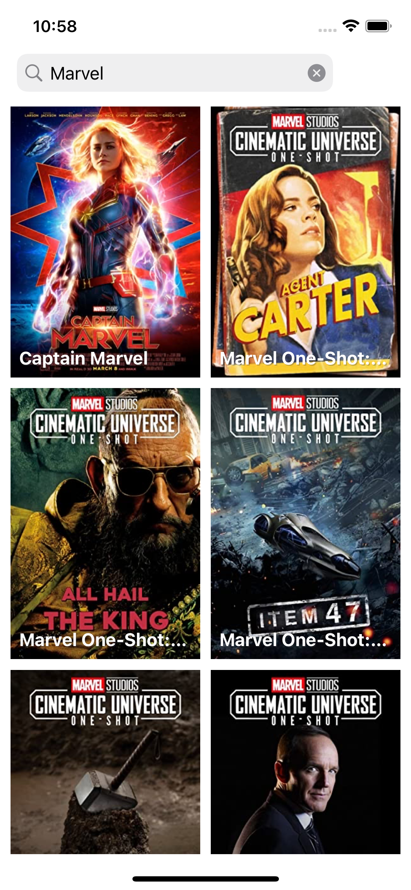
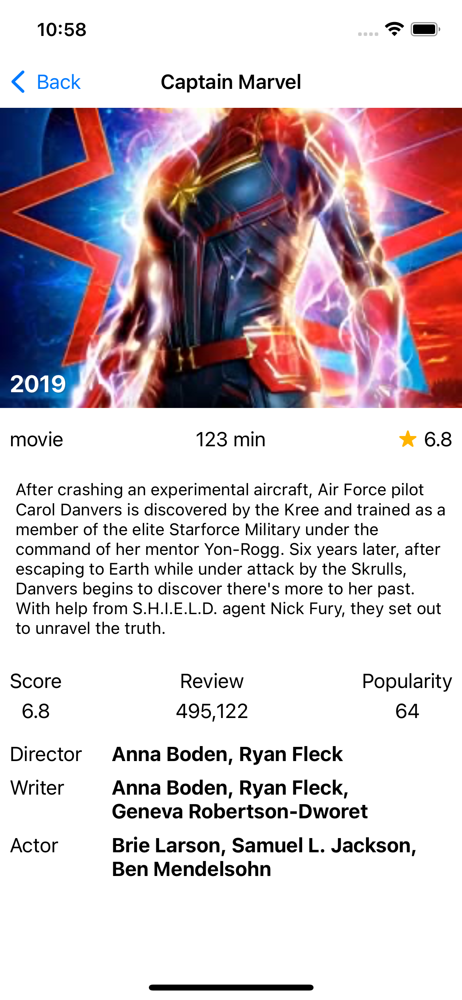

# swift-mvvm-movie
This is the sample for me to apply some iOS - Swift knowledge about UI layout, architect and coding style into.

# Screen shoot
Main Screen | Detail Screen 
------------ | -------------
 | 

# Install
```
cd current_folder
pod install
open .xcworkspace
```

# To-do List
- [x] Init project
- [ ] Add paging when scrolling up
- [ ] Add empty state
- [ ] Add final page state
- [ ] Add loading popup
- [ ] Add appearance animation after having results
- [ ] Add appearance animation at Detail
- [ ] Add routing transition
- [ ] Upgrade TDD
- [ ] Add zoom in-out animation for image at detail.
- [ ] Create a same iOS project with SwiftUI.
